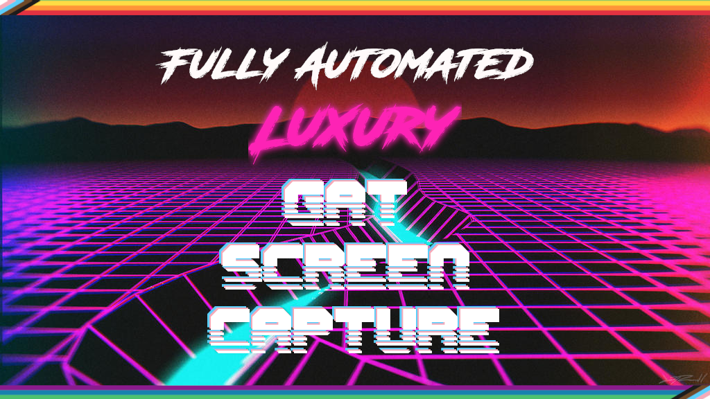

# Fully Automated Luxury GAT Screen Capture



**Premise**: We can record all of GAT automatically. Every terminal interaction, everything. Fully automated, so we can just relax on the beach while it records our workshop for us.

## Terminal Recordings

See current recordings here: https://asciinema.org/~hexylena (there are some known issues.)

[](https://asciinema.org/a/402574)

## Galaxy Recordings

We've developed a GitHub Action workflow which builds the entire training. It roughly breaks down into:

- Prep the machine with the [git-gat repo](https://github.com/hexylena/git-gat)
- Use git-gat to provision galaxy up until a specific step
- Extract a script from the tutorial
- Follow that script recording components as it goes
    - There are multiple steps to a script, these get collapsed for simplicity (e.g. 5 speaking sections becomes one long section with multiple components.)
    - `data.visual = gtn` blocks are for showing the GTN webpage and narrating over it.

       ```json
       {
         "type": "spoken",
         "text": "These words come from a transcript of Simon Gladman teaching this course. ",
         "data": {
           "visual": "gtn",
           "target": "#top-navbar"
         }
       }
       ```
    - `data.visual = galaxy` blocks show the configured Galaxy server and maybe have some interaction with the Galaxy UI.
      ```json
      {
        "type": "spoken",
        "text": "I have bwa and bwa-mem installed under Mapping.",
        "data": {
          "visual": "galaxy",
          "target": ".search-input input",
          "action": "fill",
          "value": "bwa-mem"
        }
      }
      ```
    - `data.visual = terminal` blocks visualise actions happening at the CLI, which can either be commands to be executed

      ```json
      {
        "type": "spoken",
        "text": "Well the first thing I need to do is log into my Galaxy machine in the terminal.",
        "data": {
          "visual": "terminal",
          "cmd": "whoami; hostname -f"
        }
      }
      ```

      or a diff to play in our "diff player" if a `code` block is present.

      ```json
      {
        "type": ["code", "spoken"],
        "code": "--- a/requirements.yml\n+++ b/requirements.yml\n@@ -18,3 +18,5 @@....",
        "data": {
          "commit": "Add requirement",
          "visual": "terminal"
        },
        "text": "Okay, so the first thing I'm going to do is I'm going to add the CVMFS role to the requirements.yml. Edit requirements.yml and we need to add this to the bottom offf that file. Copy. Paste. And save it."
      }
      ```
- These actions are recorded and then combined with their relevant audio files into the final section mix
- And these are then combined into the final video.

There are three distinct types of recording:

### Browser Recording

We generate a file like the following, where every section is an action to execute. We have a target or some actions that need to be executed, followed by a sleep component. This is how long we know the narration takes for that specified component.

```json
[
  {"action": "goto", "target": "https://training.galaxyproject.org/training-material/topics/admin/tutorials/cvmfs/tutorial.html"},
  {"action": "scrollTo", "target": "#top-navbar", "sleep": 8.904},
  {"action": "scrollTo", "target": "#cvmfs-quote", "sleep": 52.248},
  {"action": "scrollTo", "target": "#agenda", "sleep": 12.672},
  {"action": "scrollTo", "target": "#ansible-cvmfs-and-galaxy", "sleep": 23.28},
  {"action": "scrollTo", "target": "#installing-and-configuring", "sleep": 15.336}
]
```

We have a custom script `gat2video/video-browser-recorder.js` which processes those actions and ensures each segment is long enough. These times are generally slightly longer than the sleep, to ensure everything matches up.

```
[{"msg": {"action": "scroll", "target": "#top-navbar"}, "time": 9014},
 {"msg": {"action": "scroll", "target": "#cvmfs-quote"}, "time": 53002},
 {"msg": {"action": "scroll", "target": "#agenda"}, "time": 12720},
 {"msg": {"action": "scroll", "target": "#ansible-cvmfs-and-galaxy"}, "time": 2338},
 {"msg": {"action": "scroll", "target": "#installing-and-configuring"}, "time": 15430}]
```

### Terminal Recording

For commands that need to be executed, e.g. `whoami`, we use the amazing [`demo-magic.sh`](https://github.com/paxtonhare/demo-magic) to pretend we're typing the commands out as if we were a human. This gets captured by [`asciinema`](https://asciinema.org/) and stored in a `.cast` file.

For recording the diffs being applied, we have a custom "text editor" based on [tdryer/editor](https://github.com/tdryer/editor). That repository provided a bare bones python text editor which I've modified to take in a filename and a diff as arguments. Then it loads the filename as if it were going to edit it, and, based on the contents of the diff, pretends to type out the entire set of diff changes, before (intentionally) failing to save the file. Thus we can use asciinema again to record this diff being played out as if a human was typing it.


All of this is combined in `video-term-recorder.sh` which loops over the appropriate script portions, and uses the following logic:

- if it's a commit
	- check out the previous commit
	- fake the diff being applied.
	- checkout the real commit we should be on
- if it's a command
	- execute the command directly
- finally if the command took less time to execute, than it took to speak the associated text, sleep until we've hit the correct time.

And this again is recorded as a "script", similar to the above JSON log from the browser recording. Then, again, the video and audio components are lined up and merged together into a final video.

### Final Composition

(todo) all of the associated scenes are merged into a final video using [`editly`](https://github.com/mifi/editly)

## Cover

Thanks [redheadsoldier](https://www.deviantart.com/redheadsoldier/art/Nature-Neon-601893009) for the background image.

## License

AGPL-3.0
